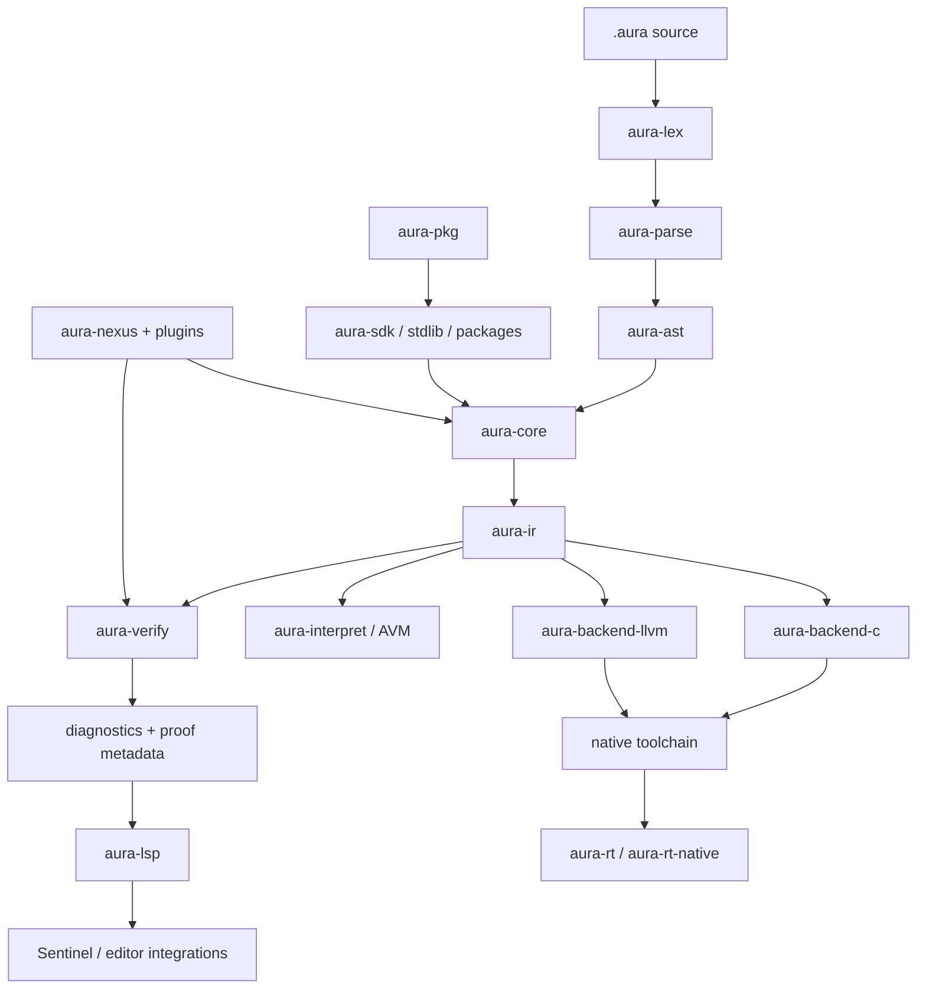
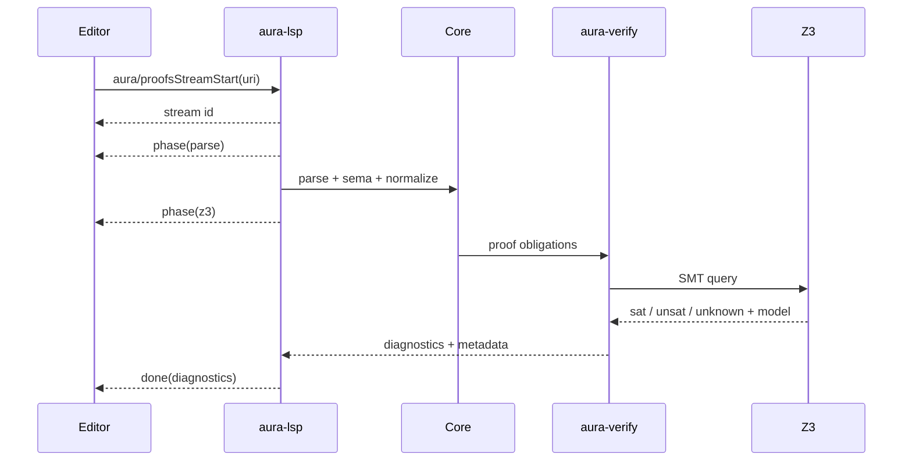
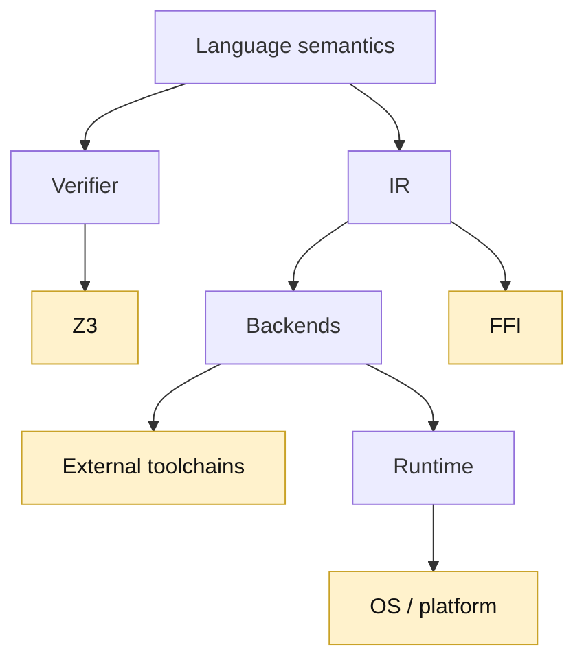

# Aura Architecture

Aura is a language-platform monorepo whose central design problem is not only “compile source code,” but **keep semantics, verification, execution, diagnostics and developer tooling aligned**.

## Architectural principles

1. **One semantic center** — parsing, semantic analysis and IR should feed all execution/verification surfaces.
2. **Proofs are developer feedback** — solver output must become source diagnostics and counterexamples.
3. **Trust is explicit** — FFI, unsafe boundaries and backend equivalence are visible engineering concerns.
4. **Fast iteration and native execution are separate modes** — AVM is optimized for the edit/run loop; native-oriented paths remain distinct.
5. **Tooling is part of the language** — LSP, Sentinel, package tooling and release artifacts are first-class architecture.
6. **Claims follow evidence** — a roadmap milestone is not automatically a stable-language guarantee.

## Top-level flow



## Layer 1 — Source language

### Lexer and parser

- `aura-lex` owns lexical processing.
- `aura-parse` turns tokens into parsed language structure.
- Significant indentation is part of the language model; the current reference describes `INDENT`, `DEDENT`, and `NEWLINE` behavior.
- editions and feature gates are passed into parse configuration.

### AST

`aura-ast` is the syntactic representation boundary. It should remain a representation of source meaning, not a backend-specific form.

## Layer 2 — Semantic core

`aura-core` is one of the densest architectural crates. Its current module surface includes:

- lowering,
- control-flow analysis,
- diagnostics,
- function-signature logic,
- ownership enforcement,
- move tracking,
- capability modeling/enforcement/validation,
- explanation infrastructure,
- network verification infrastructure,
- race-detection infrastructure.

The important architectural observation is that Aura has moved beyond a parser demo: the semantic layer already contains dedicated components for safety and explainability.

## Layer 3 — Aura IR

`aura-ir` separates source semantics from execution backends.

The LLVM path validates/optimizes Aura IR before emission. That is the correct place to express backend-independent invariants that both verifier and execution paths can reason about.

A long-term trust objective should be:

```text
source semantics
    == validated Aura IR semantics
    == backend-observable semantics
```

The repository contains compatibility/trusted-core infrastructure toward this goal, but the equality should not be marketed as globally proven today.

## Layer 4 — Verification

`aura-verify` includes substantive modules for:

- solver integration,
- proof checking,
- counterexample mapping,
- proof summaries,
- variable traces,
- linear-type verification structures,
- region/stdlib verification,
- domain geometry logic.

### Proof lifecycle



The `aura.counterexample.v2` shape is particularly important because it gives the IDE a versioned contract rather than a brittle text parser.

## Layer 5 — Execution

### AVM / development execution

`aura-interpret` provides the development VM/interpreter path and debug machinery.

The primary CLI's `avm` mode is the clearest low-friction execution surface.

### C backend

`aura-backend-c` is the default backend surface exposed by the CLI and is described as C23-oriented emission.

The C path is strategically useful because it provides:

- a portable bootstrap/native path,
- access to mature C toolchains,
- a differential reference point against other backends,
- a natural bridge to FFI and platform SDKs.

### LLVM IR backend

`aura-backend-llvm` emits LLVM IR behind a feature gate. The codebase contains code generation, debugger and pattern-lowering modules.

The backend should currently be described as **implemented and evolving**, not as a finished production optimizer. Source comments still describe parts as a skeleton/phase implementation.

### Hybrid mode

The CLI exposes `hybrid`, but current source explicitly states that automatic promotion from AVM to LLVM inside the AVM is not yet implemented.

Therefore:

```text
hybrid entry mode ≠ production JIT
```

until that promotion path exists and is tested.

## Layer 6 — Runtime and standard library

- `aura-rt` provides runtime support.
- `aura-rt-native` provides native-oriented runtime integration.
- `aura-stdlib` holds the standard-library surface.
- SDK source injection can append default std modules for SDK installs.

The standard library and runtime are part of Aura's trusted execution surface and should evolve with explicit compatibility and safety policies.

## Layer 7 — FFI

Aura exposes two complementary mechanisms:

- `aura-bridge` for bridge/link information,
- `aura bindgen` for bootstrap C/C++ header → Aura shim generation.

The current safety model distinguishes trusted and untrusted externs. This creates an explicit audit boundary rather than pretending FFI is automatically verified.

## Layer 8 — Package system

`aura-pkg` is a real subsystem with modules for:

- configuration,
- metadata,
- registry access,
- version resolution,
- lockfiles,
- cache,
- security,
- signing,
- command execution.

The package manager is architecturally important because a proof-driven language eventually needs to answer not just “is my code verified?” but also:

> what did I import, which artifact did I execute, who signed it, and what remains in the trusted boundary?

Some existing documentation describes a wider CLI than the executable currently exposes; see [ECOSYSTEM.md](ECOSYSTEM.md).

## Layer 9 — LSP and developer experience

`aura-lsp` is not a thin syntax server. Its source tree contains infrastructure for:

- proof result extraction,
- counterexample transport,
- proof streaming,
- cache layers,
- performance tuning,
- debugger protocols,
- differential-test integration,
- linear-type debugging,
- CI gate support.

The documented Aura-specific protocol version is `1`.

## Layer 10 — Aura Sentinel

Sentinel is a Tauri 2 desktop application using CodeMirror. It is the natural host for Aura-specific proof UX that cannot be represented cleanly by generic editor diagnostics alone.

The intended high-value loop is:

```text
edit
 → background proof
 → proof phase stream
 → source diagnostic
 → counterexample / variable trace
 → repair
 → re-prove
```

## Layer 11 — Nexus and plugins

The workspace includes `aura-nexus` plus optional AI, IoT and Lumina plugins. The primary CLI resolves plugin manifests and can pass plugin information into verification/build paths.

This makes plugins a language-platform concern rather than a purely editor-side extension system.

## Layer 12 — Lumina

Lumina is represented by a sizable plugin implementation plus current examples/docs. It extends Aura into declarative application UI and media experiments.

Lumina should be considered an **evolving platform layer**. Its presence is significant, but it should not redefine the stability contract of the core language.

## Layer 13 — Android

Android support is a vertical integration slice:

```text
Aura runtime / SDK
  → Android NDK target toolchain
  → cross-compiled runtime
  → Android project/sample APK
  → emulator/device tooling
```

The repository contains CI and helper tooling for this path. See [ANDROID_SUPPORT.md](ANDROID_SUPPORT.md) for scope.

## Layer 14 — Release and provenance

`tools/release/release.py` includes deterministic ZIP construction, SHA-256 calculation, attestation generation, optional Windows code signing and Sentinel sidecar staging.

That is a strong foundation for future reproducible release provenance.

## Trust architecture

A useful public trust model for Aura is:



Verification reduces uncertainty inside the model; it does not erase the trusted computing base.

## Architectural debt that matters publicly

The most important repository-wide architecture work before a stable release is not adding another feature. It is **contract convergence**:

1. reconcile version namespaces,
2. align package docs with executable commands,
3. define stable language/reference boundaries,
4. make differential CI emit measured truth rather than optimistic summaries,
5. decide which backend(s) participate in stable-release guarantees,
6. define what “safe mode” guarantees and what remains trusted,
7. publish reproducible benchmark methodology before performance SLOs become headline claims.

That work turns a large implementation into a trustworthy language product.
