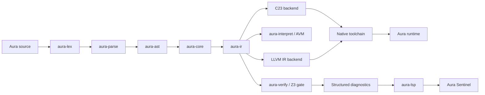

# Aura

**A proof-driven systems programming language and developer platform.**

Aura brings program verification into the normal edit → build → run loop. The repository contains the language frontend, semantic core, Aura IR, verification engine, development VM, native-oriented backends, package tooling, language server, Sentinel desktop IDE, SDK, standard library, plugins, Lumina UI runtime, FFI tooling, examples, release tooling, and Android build support.

> **Repository status:** active, pre-stable language platform. The current compiler workspace identifies itself as `0.2.0` while several component and milestone documents use later milestone labels. Aura therefore treats implementation state, component version, language edition, and roadmap milestone as separate concepts. See [Project Status](PROJECT_STATUS.md).

[Website](https://aura.geniuses.team/) · [Project status](PROJECT_STATUS.md) · [Architecture](ARCHITECTURE.md) · [Language guide](LANGUAGE_GUIDE.md) · [Verification model](VERIFICATION_MODEL.md) · [Toolchain](TOOLCHAIN.md) · [Ecosystem](ECOSYSTEM.md)

---

## Why Aura exists

Most programming languages separate three activities that should inform one another:

1. writing the program,
2. proving properties about the program,
3. understanding why a proof or execution failed.

Aura is an attempt to make those one developer workflow.

The language exposes contracts, assertions, loop invariants, refinements, resource-sensitive safety rules, explicit trust boundaries, and verification-aware tooling. The compiler and IDE are designed so that proof results can flow back into source-level diagnostics instead of remaining opaque solver output.

Aura is **not presented as a formally verified compiler**. The codebase implements a programming language with Z3-backed verification and a growing trusted-core discipline. That distinction is intentional and documented in [Verification Model](VERIFICATION_MODEL.md) and [Public Claims Policy](PUBLIC_CLAIMS_POLICY.md).

---

## What Aura looks like

Aura uses significant indentation, `cell` declarations, verifier-visible contracts, and a small current type surface that is deliberately evolving.

```aura
cell bounded_inc(x: u32[0..99]) -> u32:
    requires x < 100
    ensures result <= 100

    val next: u32 = x + 1
    assert next <= 100
    next
```

Loops can expose invariants and termination hints to the verifier:

```aura
val mut i: u32[0..5000] = 0

while i < count invariant i <= count:
    i = i + 1
```

Aura also includes UI-oriented syntax used by the Lumina plugin:

```aura
import aura::lumina

cell main():
    layout:
        VStack(alignment: "center") {
            render: Text(text: "Welcome to Aura")
            render: Button(label: "Verify") {
                on_click: ~> { log("proof requested") }
            }
        }
```

For the current implemented syntax and safety rules, use [sdk/docs/reference.md](sdk/docs/reference.md) as the compact normative snapshot. The implementation remains the source of truth when documentation and code disagree.

---

## The platform at a glance

| Surface | Repository component | Current role |
|---|---|---|
| CLI / orchestration | `aura` | build, run, verify, test, lint, init, fmt, package operations, bindgen |
| Lexer | `aura-lex` | tokenization and indentation-aware lexical layer |
| Parser | `aura-parse` | source → parsed language structures |
| AST | `aura-ast` | syntax representation |
| Semantic core | `aura-core` | lowering, diagnostics, ownership/capability analysis, explanation infrastructure |
| Intermediate representation | `aura-ir` | compiler IR, validation, optimization boundary |
| Verification | `aura-verify` | solver integration, proof checking, counterexamples, summaries, linear/region verification components |
| Development runtime | `aura-interpret` | AVM / Dev-VM execution and debug support |
| C backend | `aura-backend-c` | C23-oriented emission path |
| LLVM IR backend | `aura-backend-llvm` | feature-gated LLVM IR emission; still evolving |
| Runtime | `aura-rt`, `aura-rt-native` | runtime support and native integration |
| Standard library | `aura-stdlib` | language/runtime library surface |
| Package system | `aura-pkg` | manifests, registry/resolution, cache, lockfiles, signatures and package operations |
| Language server | `aura-lsp` | diagnostics, proof streaming, caches, debugger/profiling integration |
| Desktop IDE | `editors/sentinel-app` | Tauri + CodeMirror Aura Sentinel application |
| Editor extensions | `editors/aura-vscode`, `editors/vscode` | VS Code integration surfaces |
| Plugin host | `aura-nexus` | plugin integration and verification-aware extension surface |
| Lumina | `aura-plugin-lumina` | UI/runtime plugin and media/layout experimentation |
| Domain plugins | `aura-plugin-ai`, `aura-plugin-iot` | optional domain integration |
| FFI | `aura-bridge`, `aura bindgen` | C/C++ header bridging and generated Aura shims |
| SDK | `aura-sdk`, `sdk/` | distributable developer-facing SDK content |
| Release tooling | `tools/release/` | deterministic SDK packaging, hashes/attestations, Sentinel sidecar staging |
| Android | `sdk/android/`, Android workflow/tooling | SDK/NDK setup, runtime cross-compilation, sample APK pipeline |

The Rust workspace currently contains **22 members**, so this repository is best understood as a language platform monorepo rather than a single compiler binary.

---

## Compiler and execution pipeline



The design deliberately keeps verification and execution adjacent but separate. A proof result is not silently treated as evidence that every backend stage is correct; backend parity, compatibility tests, and trusted-core audits exist as distinct concerns.

See [Architecture](ARCHITECTURE.md).

---

## Proof-driven development

Aura's verification layer supports a developer-facing vocabulary rather than exposing raw SMT as the primary interface:

- `requires` for preconditions,
- `ensures` for postconditions,
- `assert` for proof obligations,
- `assume` for explicit proof assumptions,
- `while ... invariant ...` for loop invariants,
- `decreases` hints for termination-oriented reasoning,
- range refinements such as `u32[0..100]`,
- quantifier support where appropriate,
- structured counterexamples when a model is available.

With the `z3` feature enabled:

```bash
cargo run -p aura --features z3 -- verify main.aura --smt-profile fast
```

Solver profiles exposed by the CLI:

```text
fast       interactive / low-latency-oriented profile
ci         CI-oriented profile
thorough   deeper verification profile
```

An optional incremental mode can keep solver state warm inside a run:

```bash
AURA_Z3_INCREMENTAL=1 cargo run -p aura --features z3 -- verify main.aura
```

### Counterexamples are part of the protocol

Aura's LSP protocol can attach structured counterexample data to diagnostics and map solver bindings back toward source ranges. `aura.counterexample.v2` supports binding metadata and source-anchored injections that an editor can render as ghost text.

See:

- [Verifier guide](sdk/docs/verifier-guide.md)
- [Z3 Gate protocol](sdk/docs/z3-gate.md)
- [LSP stability contract](sdk/docs/lsp-stability.md)
- [Verification model](VERIFICATION_MODEL.md)

---

## Safety and trust boundaries

Aura's current safety model is intentionally more precise than the phrase “memory safe language.”

The current reference documents resource-move rules for resource-like types, mutable-capture restrictions for async lambdas, and explicit `unsafe:` requirements around untrusted FFI. The codebase also contains ownership, capability, move-tracking, race-detection, region, and explanation modules that extend this direction.

What the public repository **does support** is the idea that trust should be visible:

```aura
extern cell native_call(...) -> u32
trusted extern cell audited_call(...) -> u32
```

Untrusted foreign calls require an explicit unsafe boundary in the current model. Trusted externs are a deliberate assertion of trust and should be treated as part of the trusted computing base, not as “proved automatically.”

See [Verification Model](VERIFICATION_MODEL.md).

---

## Build and run

### Prerequisites

Core development:

- Rust stable toolchain
- a C compiler / Clang for C-backed native paths and compatibility checks

Optional features:

- Z3 for solver-backed verification
- LLVM/toolchain support for the LLVM path
- Node.js/npm + Tauri prerequisites for Aura Sentinel
- Android SDK/NDK + Java for Android tooling

### Inspect the CLI

```bash
cargo run -p aura -- --help
```

### Build

```bash
cargo run -p aura -- build main.aura
```

The CLI exposes build profiles (`dev`, `release`, `verify`) and execution modes (`avm`, `llvm`, `hybrid`). The default backend is the C-oriented path; LLVM support is feature-gated and remains an evolving backend.

### Run in the development VM / hybrid entry path

```bash
cargo run -p aura -- run main.aura
```

Important: current source explicitly notes that automatic AVM → LLVM promotion inside hybrid execution is **not yet implemented**. “Hybrid” should therefore not be interpreted as a production JIT.

### Verify

```bash
cargo run -p aura --features z3 -- verify main.aura --smt-profile fast
```

### Test Aura programs

```bash
cargo run -p aura -- test .
```

### Lint and format

```bash
cargo run -p aura -- lint main.aura
cargo run -p aura -- fmt main.aura --check
cargo run -p aura -- fmt main.aura --write
```

### Generate C bindings

```bash
cargo run -p aura -- bindgen --header demo.h --out build/bindgen
```

Best-effort refined type mapping:

```bash
cargo run -p aura -- bindgen \
  --header demo.h \
  --out build/bindgen \
  --refine-types
```

See [Toolchain](TOOLCHAIN.md) for the verified command surface and backend caveats.

---

## Aura Sentinel

Aura Sentinel is the desktop development environment in `editors/sentinel-app`. It is a Tauri 2 application built around CodeMirror and connected to `aura-lsp`.

The repository contains infrastructure for:

- Aura-aware editing,
- proof streaming,
- structured diagnostics,
- counterexample visualization,
- debugger protocol integration,
- proof/performance telemetry surfaces.

Run it from source:

```bash
cd editors/sentinel-app
npm install
npm run tauri:dev
```

The release tooling can stage `aura-lsp` as a sidecar for bundled Sentinel builds.

---

## Language server

Run the LSP directly:

```bash
cargo run -p aura-lsp
```

Aura-specific protocol extensions are versioned separately from ordinary LSP compatibility. The current documented Aura protocol version is `1`.

The codebase includes proof-stream handling, counterexample mapping, Merkle/performance caches, CI-gate integration, debugger protocol modules, and performance-tuning infrastructure.

---

## Package system

Aura includes a substantive package-manager crate rather than only a manifest parser. The `aura-pkg` crate contains cache, registry, resolver, lockfile, security, metadata, signing, configuration, and command modules.

The standalone package-manager CLI currently exposes:

```text
init
add
remove
list
publish
verify
```

The main `aura` CLI also exposes a package surface with commands including add, publish, and deprecate.

Package documentation in this repository contains additional designed commands and future-facing examples. Those docs should not be read as proof that every shown command exists in the current executable. [Ecosystem](ECOSYSTEM.md) separates implemented command surfaces from documented design.

The package system includes code for SHA-256 integrity, SemVer-oriented resolution, caching, and optional Ed25519 signing.

---

## Lumina and application UI

`aura-plugin-lumina` is a real workspace component, not only a syntax proposal. The current repository includes UI examples and recent work around:

- layout primitives,
- input handling,
- `TextInput`,
- `Box`,
- grids,
- image fit modes,
- audio controls,
- app-level themes,
- Raylib-backed rendering support.

Example:

```bash
cargo run -p aura -- run examples/grid_image_audio.aura
```

Exact runtime requirements depend on the selected Lumina/backend configuration.

See:

- [Lumina UI](docs/lumina-ui.md)
- [Lumina media](docs/lumina-media.md)
- [Lumina cookbook](docs/cookbook-lumina-ui.md)

---

## Android

Aura's repository includes an Android toolchain surface with more substance than a roadmap bullet:

- Android SDK/NDK setup automation,
- a Windows CI workflow that builds a sample APK,
- runtime cross-compilation checks for `aarch64-linux-android` and `armv7-linux-androideabi`,
- APK builder/emulator helper tooling,
- Android-specific SDK content.

The precise public claim is therefore **Android build/runtime tooling and sample APK integration**, not “every Aura program is fully production-ready on Android.”

See [Android Support](ANDROID_SUPPORT.md).

---

## Examples

The repository includes examples that exercise different parts of the platform:

| Example | Focus |
|---|---|
| `examples/verification/` | contracts and verifier workflows |
| `examples/aura-move/` | resource/move-oriented safety |
| `examples/aura-iot-safe/` | safety-oriented IoT integration |
| `examples/aura-vision-safe/` | vision/domain plugin direction |
| `examples/concurrent_queue.aura` | concurrency-oriented example |
| `examples/tcp_echo_server.aura` | networking surface |
| `examples/grid_image_audio.aura` | Lumina grid/image/audio UI |
| `examples/aura-code/` | general Aura examples |

The existence of an example demonstrates a repository integration path; it does not by itself elevate every referenced subsystem to a stable-language guarantee.

---

## Release engineering

Aura includes release tooling in `tools/release/release.py` that can build a portable SDK staging tree and deterministic ZIP output. The script also contains support for:

- deterministic archive metadata,
- SHA-256 artifact hashing,
- artifact attestation JSON,
- optional Windows signing,
- Sentinel/LSP sidecar staging,
- reproducible repacking of ZIP-like artifacts.

The repository documents three conceptual channels:

```text
nightly → beta → stable
```

That is a release policy, not a claim that all three channels currently have published artifacts. See [docs/release-channels.md](docs/release-channels.md).

---

## Repository architecture

```text
aura-lang/
├── aura/                     # primary CLI / orchestration
├── aura-lex/                 # lexer
├── aura-parse/               # parser
├── aura-ast/                 # AST
├── aura-core/                # semantic core / lowering / safety analysis
├── aura-ir/                  # IR + validation/optimization boundary
├── aura-verify/              # verification engine
├── aura-interpret/           # AVM / Dev-VM
├── aura-backend-c/           # C-oriented backend
├── aura-backend-llvm/        # LLVM IR backend
├── aura-rt/                  # runtime
├── aura-rt-native/           # native runtime support
├── aura-stdlib/              # standard library
├── aura-pkg/                 # package manager
├── aura-lsp/                 # language server
├── aura-sdk/                 # SDK crate
├── aura-bridge/              # FFI bridge
├── aura-nexus/               # plugin/integration layer
├── aura-plugin-lumina/       # Lumina UI plugin
├── aura-plugin-ai/           # optional AI plugin
├── aura-plugin-iot/          # optional IoT plugin
├── aura-ai-opt/              # AI-oriented optimization tooling
├── editors/                  # Sentinel + editor integrations
├── sdk/                      # SDK docs/std/android material
├── examples/                 # Aura programs and integration examples
├── tools/                    # release, compat, trusted-core, bridges, Z3
├── docs/                     # design/reference/history/reports
└── website/                  # project website source
```

For a navigation map that distinguishes current reference material from historical completion reports and generated copies, see [Repository Map](REPOSITORY_MAP.md).

---

## Current status: read this before quoting a version number

Aura currently has several version namespaces in the same monorepo:

- workspace / primary `aura` CLI: `0.2.0`,
- Aura Sentinel package: `0.2.0`,
- `aura-pkg`: `1.0.0`,
- documentation contains completed `v0.3` milestone language and `v1.0` phase/reliability material,
- language-facing material uses the **2026 Edition** concept.

Those are not interchangeable.

For public communication, this repository uses:

> **Aura 2026 Edition — active, pre-stable language platform**

until a single repository-wide release version and compatibility contract are formally cut.

See [Project Status](PROJECT_STATUS.md).

---

## Evidence levels

Because Aura is a proof-driven project, its own public documentation should hold itself to the same standard.

This repository distinguishes:

| Label | Meaning |
|---|---|
| **CODE-BACKED** | implementation exists on the audited `main` tree |
| **REFERENCE-BACKED** | documented in the current language/protocol reference |
| **WORKFLOW-BACKED** | automation exists, but a specific passing run must still be cited before claiming success |
| **HISTORICAL-REPORT** | milestone/completion document; useful evidence, not the current executable contract |
| **TARGET** | explicit goal, SLO, roadmap item, or design objective |
| **EXPERIMENTAL** | implemented or prototyped but not presented as a stable contract |

See [Public Claims Policy](PUBLIC_CLAIMS_POLICY.md).

---

## CI and trust

The repository has a straightforward workspace CI path that runs:

```text
cargo test
compatibility suite
trusted-core baseline audit
```

There are also more ambitious differential-testing workflows. During the public-repository audit used to prepare this README, some differential-test reporting paths were found to be too optimistic or stale to use as public proof badges without repair. For that reason this README deliberately does **not** claim “100% backend agreement” or display a differential-proof badge.

That is a documentation choice, not an attempt to hide the workflow. A proof-driven project should not publish stronger evidence than the automation actually produces.

---

## Documentation

Start here:

- [Project Status](PROJECT_STATUS.md) — what is implemented, experimental, targeted, or historically documented
- [Architecture](ARCHITECTURE.md) — compiler, verifier, runtime, IDE and ecosystem architecture
- [Language Guide](LANGUAGE_GUIDE.md) — current syntax and semantics tour
- [Verification Model](VERIFICATION_MODEL.md) — contracts, Z3, counterexamples and trusted boundaries
- [Toolchain](TOOLCHAIN.md) — actual CLI modes, backends and commands
- [Ecosystem](ECOSYSTEM.md) — packages, SDK, Sentinel, Lumina, plugins and release tooling
- [Android Support](ANDROID_SUPPORT.md) — precise Android scope
- [Repository Map](REPOSITORY_MAP.md) — navigate the monorepo without confusing generated/history docs for current reference
- [Public Roadmap](ROADMAP_PUBLIC.md) — concise forward path without replacing the detailed historical `ROADMAP.md`
- [Docs Index](docs/README.md) — map to existing detailed documentation

Deep existing references:

- [SDK reference](sdk/docs/reference.md)
- [Verifier guide](sdk/docs/verifier-guide.md)
- [Z3 Gate protocol](sdk/docs/z3-gate.md)
- [Debug protocol](docs/debug-protocol.md)
- [Effects & ownership model](docs/effects-ownership-model.md)
- [Lumina UI](docs/lumina-ui.md)
- [Release channels](docs/release-channels.md)

---

## Contributing

Aura spans compiler theory, formal methods, systems programming, IDE/LSP work, runtime engineering and platform tooling. Contributions should therefore state not only *what changed* but also which contract was affected:

- syntax/grammar,
- type or safety semantics,
- IR,
- verifier behavior,
- backend behavior,
- protocol/schema,
- runtime ABI,
- package/release behavior.

Read [CONTRIBUTING.md](CONTRIBUTING.md) before opening a large language-design or semantic change.

For security-sensitive reports, use [SECURITY.md](SECURITY.md) rather than a public issue.

---

## License

Aura is distributed under the repository's [MIT License](LICENSE).

---

## Audit basis

This public wrapper was prepared on **2026-08-18** against the `main` tree headed by commit:

```text
70fefa4c6d570a4bb73aef0fe766eb610ae697a1
```

The wrapper intentionally prefers current code and compact normative references over older milestone prose when the two disagree.
