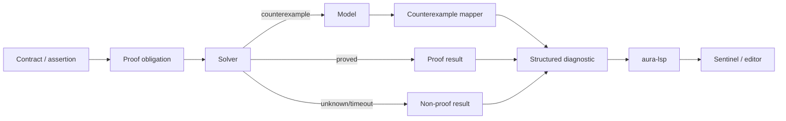

# Aura Verification Model

Aura's identity is **proof-driven development**: contracts and proof feedback are integrated into the language toolchain and editor workflow.

This document also defines what Aura does *not* claim. In particular, the repository does not establish that the compiler itself is formally verified end-to-end.

## Verification surfaces

### Source-level contracts

Aura exposes:

- `requires`
- `ensures`
- `assert`
- `assume`
- loop `invariant`
- `decreases`
- range refinements
- quantifiers where supported

These constructs are lowered into proof obligations consumed by the verification layer.

## Solver integration

Z3 support is feature-gated.

```bash
cargo run -p aura --features z3 -- verify main.aura
```

Profiles:

```text
fast
ci
thorough
```

An optional incremental solver mode is documented through:

```bash
AURA_Z3_INCREMENTAL=1
```

The presence of an incremental mode is an implementation fact. A specific latency such as `<200ms P95` is a performance claim and requires benchmark evidence for the relevant workload/commit.

## Proof result lifecycle



A timeout or solver `unknown` must never be represented as a proof.

## Z3 Gate

Aura Sentinel communicates with `aura-lsp` through a custom proof-stream protocol documented in `sdk/docs/z3-gate.md`.

Key states:

```text
start
phase
 done
error
cancelled
```

Key phases can include:

```text
parse
sema
normalize
z3
```

The protocol is designed to keep proof work non-blocking and cancellable from the editor.

## Counterexamples

Aura's verifier/LSP infrastructure can attach machine-readable data to diagnostics.

The documented `aura.counterexample.v2` schema can include:

- binding name,
- value,
- value kind,
- Aura type when known,
- relevance flag,
- source range,
- source-anchored ghost-text injections.

That moves the UX from:

```text
solver returned SAT
```

closer to:

```text
this assertion fails when x = 12 here
```

which is one of Aura's strongest architectural differentiators.

## Proof summaries and caching

The repository contains proof-summary and cache infrastructure intended to reduce unnecessary re-verification and let module boundaries carry reusable proof information.

Caching must always be invalidation-safe. A stale proof cache is worse than no cache because it creates false confidence.

## Ownership and linearity

The codebase contains dedicated modules for:

- ownership enforcement,
- move tracking,
- linear types,
- capability enforcement,
- region-oriented verification,
- race detection.

The current compact language reference exposes a narrower MVP safety contract. Therefore public material should distinguish:

```text
implemented analysis infrastructure
```

from:

```text
stable language guarantee
```

until those are reconciled in a normative spec.

## FFI and trust

Aura distinguishes ordinary external declarations from trusted external declarations.

An untrusted foreign call requires an explicit `unsafe:` boundary in the current reference. This is a valuable design property because it makes the trusted computing base inspectable.

A trusted external declaration means:

> this external function is being accepted as trusted input to the program's correctness story.

It does **not** mean Aura proved the external implementation.

## Trusted core

The repository includes `tools/trusted-core/` and a CI step that audits a trusted-core baseline.

A useful trust decomposition is:

```text
Aura source + proof obligations
        │
        ├── trusted: solver implementation / invocation assumptions
        ├── trusted: compiler correctness not yet formally established
        ├── trusted: backend/toolchain correctness where not differentially established
        ├── trusted: runtime/OS/hardware
        └── trusted: explicitly trusted FFI
```

The purpose of verification is to **shrink and expose uncertainty**, not pretend the trusted base has vanished.

## Backend alignment

Proofs are about modeled program semantics. Execution correctness additionally depends on lowering and backend behavior.

Aura includes compatibility and differential-testing infrastructure because this gap matters:

```text
proved source property
       ↓
validated IR
       ↓
backend lowering
       ↓
executed artifact
```

Public “backend parity” claims should only be made from measured workflows that fail when the backends diverge.

## CI evidence warning

The current repository contains multiple differential-testing workflows. At audit time, at least one workflow/reporting path could emit success-oriented summaries even when debugger commands were allowed to fail, and another referenced assets not found through repository search.

For that reason this public wrapper intentionally avoids “100% differential agreement” claims.

See the delivery-only `CI_INTEGRITY_AUDIT.md` for exact findings.

## Performance SLOs

Historical planning documents define ambitions such as:

- interactive proof latency,
- `<200ms P95` for typical edit cycles,
- fast counterexample/explain rendering.

These are appropriate engineering goals. They become public benchmark facts only when paired with:

1. commit SHA,
2. hardware/software environment,
3. corpus/workload,
4. warm/cold cache state,
5. Z3 version/configuration,
6. sample count,
7. percentile methodology,
8. raw or reproducible output.

## Verification vocabulary for public documentation

Use these phrases:

- **“Z3-backed verification”** — supported.
- **“proof-driven programming language”** — supported.
- **“contracts and invariants integrated into the toolchain”** — supported.
- **“structured counterexample mapping”** — supported.
- **“formally verified compiler”** — not established.
- **“all Aura programs are memory safe”** — too broad today.
- **“sub-200ms proofs”** — use only with benchmark qualification; otherwise call it a target.

That language keeps the project technically impressive without sacrificing credibility.
